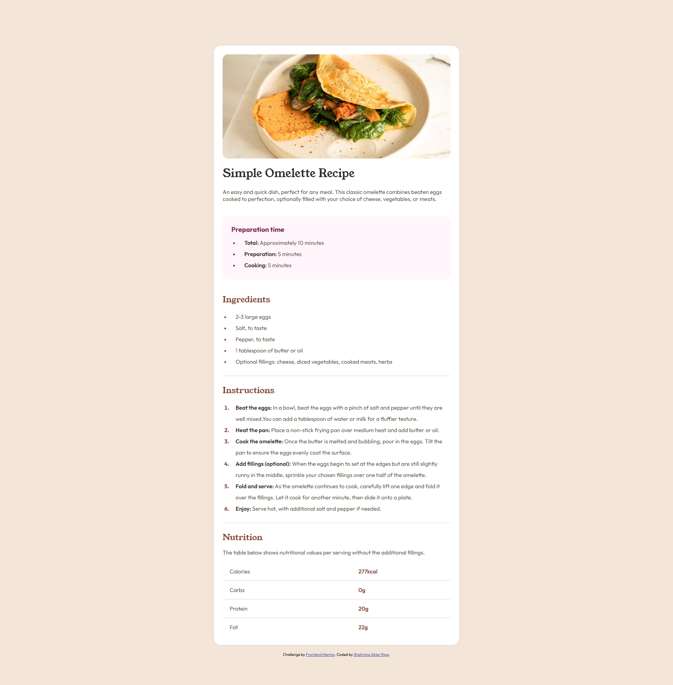

# Frontend Mentor - Recipe Page Solution

This is my solution to the **Recipe Page** challenge on Frontend Mentor.

## Overview

This project helped me practice semantic HTML, CSS layout, responsive design, list styling, and table elements.

I focused on writing clean HTML and organizing my CSS with comments to make the code easier to read and maintain.

### Links

- Solution URL: https://github.com/ripa221/recipe-page-main
- Live Site URL: https://ripa221.github.io/recipe-page-main/

## Built With

- Semantic HTML5
- CSS3
- Flexbox
- CSS Variables
- Mobile-first responsive adjustments
- Google Fonts

## What I Learned

While building this project, I learned a lot about how browsers actually work instead of only memorizing CSS properties.

Some of the things I practiced include:

- Using semantic HTML elements properly
- Styling ordered and unordered list markers with `::marker`
- Working with CSS variables
- Responsive layouts using media queries
- Understanding parent and child spacing
- Using tables for structured data

One of my biggest improvements was learning how to style list markers and understanding why semantic HTML is important.

## Challenges I Faced

The nutrition table was the most challenging part of this project.

While building it, I discovered that I still need a better understanding of:

- Table layout
- CSS selectors like `:first-child` and `:last-child`
- How the CSS box model behaves inside table elements

Instead of copying solutions, I spent time experimenting with different approaches, which helped me understand browser behavior much better.

## Continued Development

For my next projects, I want to improve my understanding of:

- CSS selectors
- Table layouts
- Browser rendering behavior
- Responsive design
- Writing cleaner and more maintainable CSS

## Useful Resources

- MDN Web Docs
- Frontend Mentor
- CSS Tricks

## Author

- Frontend Mentor - @ripa221